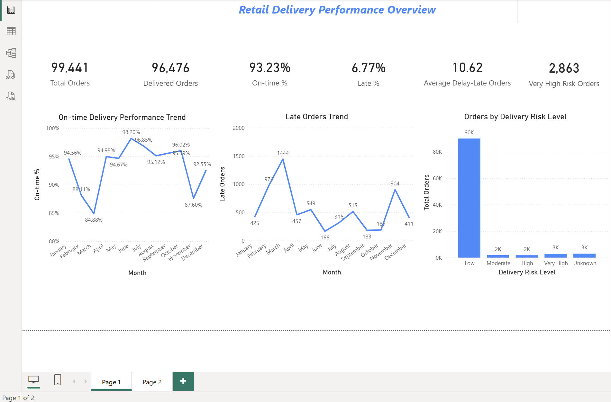
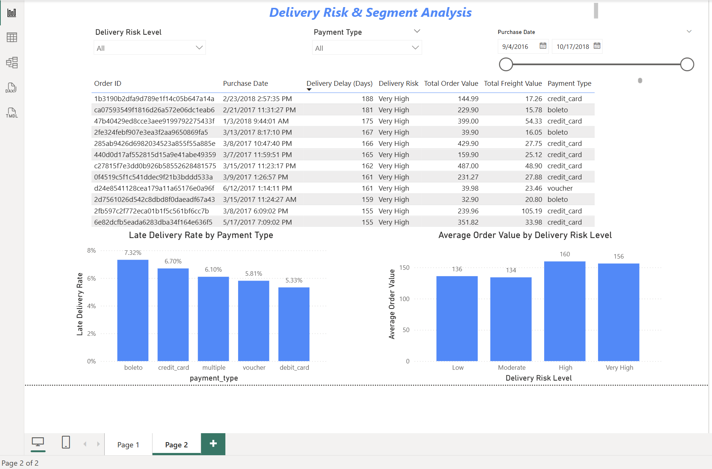

# Retail Sales ETL & Delivery Performance Analytics

An end-to-end e-commerce analytics project using Python, Pandas, NumPy and Power BI to investigate delivery performance, understand its relationship with customer dissatisfaction, evaluate potential delivery-risk factors, build a business-oriented risk segmentation framework, and operationalize the analysis through a reproducible ETL pipeline.

The project follows the analytical journey from **broad exploratory analysis across the Olist dataset → business-question-driven investigation → evidence-based decisions → order-level ETL → risk segmentation → Power BI reporting**.

---

## Project at a Glance

**Business problem:**  
Late deliveries are relatively uncommon at an overall level, but severe delivery delays can have a disproportionate effect on customer experience. The objective was to understand delivery performance, investigate which factors were associated with delivery problems and customer dissatisfaction, and create an actionable order-level view for monitoring and investigation.

**Core analytical question:**

> **How can an e-commerce business identify, quantify and investigate delivery-performance risk at order level?**

**Final outcome:**

- A reproducible Python ETL pipeline
- A clean one-row-per-order analytical dataset
- A rule-based delivery-risk segmentation
- A two-page interactive Power BI dashboard
- A documented analytical trail showing why certain variables were retained, excluded or treated only as contextual dimensions

---

# 1. Business Objective

The project was not designed simply to create a dashboard from the Olist data.

The broader objective was to answer a sequence of business questions:

1. How is Olist's delivery performance overall?
2. How should delivery performance be measured?
3. Does delivery performance vary over time?
4. Is late delivery associated with customer dissatisfaction?
5. Does the severity of the delay matter?
6. Which customer, order, product, seller, payment and logistics-related factors show meaningful association with delivery performance?
7. Which of those factors are strong enough to influence a practical risk framework?
8. What should the final analytical dataset contain?
9. How can that dataset be transformed into a repeatable pipeline and useful business dashboard?

This distinction is important: **the ETL pipeline is the operational implementation of decisions reached during the EDA. It is not the entire analysis.**

---

# 2. Dataset

## Source

**Brazilian E-Commerce Public Dataset by Olist**

https://www.kaggle.com/datasets/olistbr/brazilian-ecommerce

The original dataset consists of multiple related CSV tables covering orders, customers, products, sellers, payments, reviews, geography and supporting category information.

The full dataset contains approximately 100,000 orders covering the 2016–2018 period.

### Source tables available in the dataset

| Dataset | Analytical role explored |
|---|---|
| `olist_orders_dataset.csv` | Order lifecycle, purchase date, estimated delivery and actual delivery |
| `olist_order_items_dataset.csv` | Products within orders, item price and freight |
| `olist_order_payments_dataset.csv` | Payment methods and payment records |
| `olist_order_reviews_dataset.csv` | Review scores used to examine customer dissatisfaction |
| `olist_customers_dataset.csv` | Customer information and customer-level context |
| `olist_products_dataset.csv` | Product-level information and category analysis |
| `olist_sellers_dataset.csv` | Seller-level investigation |
| `olist_geolocation_dataset.csv` | Geographic information available for potential logistics analysis |
| `product_category_name_translation.csv` | English category labels for product-category analysis |

The project deliberately **did not carry every source table into the final ETL pipeline**. The broader dataset was useful during EDA, while only the information required for the final delivery-performance analytical use case was carried into the production-style output.

---

# 3. Project Structure

```text
Retail-Sales-ETL-Pipeline/
│
├── data/
│   ├── olist_orders_dataset.csv
│   ├── olist_order_items_dataset.csv
│   ├── olist_order_payments_dataset.csv
│   └── processed/
│       └── final_orders.csv
│
├── notebooks/
│   └── 01_Data_Profiling.ipynb
│
├── scripts/
│   └── etl_pipeline.py
│
├── powerbi/
│   └── Retail_Delivery_Performance.pbix
│
├── images/
│   ├── dashboard_overview.png
│   └── dashboard_risk_analysis.png
│
└── README.md
```

The project has three complementary layers:

- **Notebook:** detailed exploratory analysis and analytical reasoning
- **Python ETL script:** reproducible transformation of raw data into the final analytical dataset
- **Power BI:** business-facing reporting and operational investigation

---

# 4. Analytical Approach: From Broad EDA to Final Solution

The project started with the full Olist data rather than assuming in advance which variables would matter.

The analytical process was:

```text
Full Olist dataset
        ↓
Data profiling and structural understanding
        ↓
Exploratory analysis across multiple dimensions
        ↓
Define delivery-performance metrics
        ↓
Investigate relationship between delay and customer dissatisfaction
        ↓
Evaluate candidate delivery-related factors
        ↓
Separate strong evidence from weaker/contextual relationships
        ↓
Choose the correct order-level analytical grain
        ↓
Define delivery-risk levels
        ↓
Build reproducible ETL pipeline
        ↓
Create Power BI dashboard
```

The purpose of the EDA was therefore not to use every available column.

It was to determine:

> **Which information actually helps answer the business question, and which information should not be carried forward?**

That decision-making process is a central part of the project.

---

# 5. Data Profiling and Structural Understanding

The project began with Python/Jupyter profiling to understand the structure and quality of the Olist data.

The profiling stage examined:

- Dataset dimensions
- Column names and data types
- Missing values
- Duplicate records
- Unique identifiers
- Date fields and date ranges
- Relationships between the Olist tables
- One-to-many relationships
- The appropriate analytical grain for the final solution

## The key modeling decision: one row per order

A major structural issue was that different source tables operate at different grains.

For example:

- `orders` → generally one row per order
- `order_items` → multiple rows can belong to one order
- `payments` → multiple payment records can belong to one order
- `reviews` → customer-experience information is separate from the operational order record

For delivery-performance monitoring, the natural analytical grain was determined to be:

> **One row = one order**

This became an important design principle for the rest of the project.

Before joining item-level and payment-level information to the order table, those tables therefore had to be aggregated or consolidated by `order_id`.

This prevented one-to-many joins from unintentionally duplicating orders.

---

# 6. Exploratory Delivery-Performance Analysis

## 6.1 Defining delivery delay

The central metric was created as:

```text
delivery_delay_days =
actual_delivery_date - estimated_delivery_date
```

Interpretation:

- **≤ 0 days:** delivered on or before the estimated date
- **1+ days:** delivered after the estimated date
- **Missing:** no recorded delivery date

This metric became the foundation for both the delivery-performance analysis and the final risk classification.

---

## 6.2 Overall delivery performance

The final analysis established:

| KPI | Result |
|---|---:|
| Total orders | 99,441 |
| Delivered orders | 96,476 |
| On-time delivered orders | 89,941 |
| Late delivered orders | 6,535 |
| On-time rate | 93.23% |
| Late rate | 6.77% |
| Average delay among late orders | 10.62 days |
| Very High Risk orders | 2,863 |

The on-time and late rates use **delivered orders as the denominator**.

This was an intentional analytical decision.

Orders without a recorded delivery date were not treated as on-time, because:

> **unknown delivery status is not the same thing as successful on-time delivery.**

---

# 7. Time-Based Analysis

Monthly analysis showed that annual averages can hide periods of operational stress.

The observed monthly results showed meaningful variation:

- The lowest observed monthly on-time rate was approximately **84.88% in March**.
- The highest observed monthly on-time rate was approximately **98.20% in June**.
- March also recorded the highest number of late orders, approximately **1,444**.
- November showed another notable increase in late orders, approximately **904**.

### Analytical conclusion

Overall delivery performance looked strong at the aggregate level, but performance was not equally stable across time.

This suggests that an operational dashboard should allow business users to investigate **when** delivery problems increase rather than relying only on one annual KPI.

This finding directly influenced the inclusion of time trends in the Power BI overview page.

---

# 8. Customer Dissatisfaction Analysis

A major part of the EDA was connecting the operational delivery metric to customer experience.

The review dataset was used to investigate whether delivery delays were associated with lower customer satisfaction.

For this analysis, **review scores of 1 or 2 were treated as dissatisfaction**.

## 8.1 Late delivery and dissatisfaction

Among reviewed orders that were delivered late:

> **62.35% were associated with a dissatisfied review (score ≤ 2).**

For comparison, the overall dissatisfaction baseline was approximately:

> **14.67%**

This was one of the most important findings in the entire EDA.

It established that delivery performance was not merely an operational KPI; it was strongly associated with customer experience.

### Important analytical caveat

This result is an **association**, not proof that delivery delay alone caused the low review score.

Customers can be dissatisfied for multiple reasons.

However, the size of the difference between late-delivery orders and the overall dissatisfaction baseline provided strong business evidence that delivery performance deserved deeper investigation.

---

# 9. The Severity of Delay Matters

The next question was:

> **Is any late delivery equally problematic, or does customer dissatisfaction increase as the delay becomes more severe?**

The delay was therefore broken into increasingly severe buckets.

| Delivery delay | Dissatisfaction |
|---|---:|
| 1–3 days late | 32.14% |
| 4–7 days late | 67.53% |
| 8–13 days late | 79.95% |
| 14+ days late | 78.71% |

## What the analysis showed

There was a major jump in dissatisfaction between:

**1–3 days late → 4–7 days late**

and dissatisfaction remained very high beyond that point.

In other words:

> **The severity of the delay matters, and the customer-experience impact becomes substantially more concerning once delays move beyond a few days.**

The results also suggested a plateau at very large delays: dissatisfaction was already extremely high in the 8–13 day group and did not increase further in the 14+ day group.

This observation was important when designing the final risk segmentation.

---

# 10. Investigation of Candidate Factors

The next stage of the EDA asked a broader question:

> **Besides the delay itself, which available business dimensions appear to be associated with delivery problems?**

Multiple dimensions were investigated rather than assuming that every variable was a meaningful predictor.

The main areas considered included:

- Order value
- Product category
- Seller
- Payment type
- Freight burden
- Customer / repeat-customer characteristics
- Review outcomes
- Other information available in the broader Olist dataset

The goal was not to maximize the number of variables.

The goal was to identify **useful and defensible business relationships**.

---

# 11. Order Value

Order value was investigated to determine whether higher-value orders were more exposed to delivery problems.

The EDA showed some variation in delivery performance across order-value segments, but the relationship was not strong enough to make order value the main basis for delivery-risk classification.

The final dashboard also showed variation in average order value across risk levels:

| Risk level | Approx. average order value |
|---|---:|
| High | 160 |
| Very High | 156 |
| Low | 136 |
| Moderate | 134 |

### Conclusion

Order value contains useful context, but it does not provide a sufficiently strong or consistent basis for defining delivery risk.

**Decision:**

- Keep order value in the final analytical dataset.
- Use it for segment analysis and business context.
- Do not use it as the primary risk-classification rule.

This is an important distinction between a **contextual analytical variable** and a **risk-defining variable**.

---

# 12. Product Category

Product-category analysis showed that delivery performance was not identical across all product categories.

However, category-level variation was weaker and less consistent than the direct relationship between delivery delay and customer dissatisfaction.

### Conclusion

Product category can be useful for deeper operational investigation, but it was not strong enough to form a universal delivery-risk rule across the entire dataset.

**Decision:**

- Investigated during EDA.
- Not included in the final order-level risk classification.
- Identified as a possible future area for category-specific operational analysis.

---

# 13. Seller Analysis

Seller-level performance was also considered because sellers can have very different fulfillment and delivery outcomes.

The analysis suggested that individual sellers can be useful for monitoring and investigation.

However, seller behavior did not translate into a single general risk rule that would be appropriate for every order in the dataset.

### Conclusion

Seller information is valuable for:

- identifying problematic sellers
- comparing seller performance
- conducting root-cause analysis

but it was not used as a universal order-level risk score.

**Decision:**

Seller analysis was treated as a potential operational drill-down rather than a core component of the final risk classification.

---

# 14. Payment Type

Payment type showed some variation in late-delivery rates.

The final Power BI analysis showed approximately:

| Payment type | Late-delivery rate |
|---|---:|
| boleto | 7.32% |
| credit_card | 6.70% |
| multiple | 6.10% |
| voucher | 5.81% |
| debit_card | 5.33% |

### Conclusion

There is visible variation, but the differences were not strong enough to claim that payment type is a direct cause of delivery delay.

**Decision:**

Payment type was retained as a **contextual segmentation dimension** in the final dataset and dashboard, but it was not used to define delivery-risk levels.

This allows a business user to investigate payment-related patterns without overstating the evidence.

---

# 15. Freight Burden

Freight cost relative to the order was also considered as a potential operational factor.

The relationship with delivery performance was weak compared with the central delivery-delay/customer-dissatisfaction relationship.

### Conclusion

Freight burden did not provide enough incremental explanatory value to justify including it in the delivery-risk classification.

However, freight value itself was still retained in the final analytical dataset because it is useful for operational and commercial analysis.

This is another example of distinguishing:

**"useful to analyze"** from **"strong enough to define risk."**

---

# 16. Customer / Repeat-Customer Characteristics

Customer-level and repeat-customer behavior were also considered as possible dimensions of delivery performance.

The observed relationship was weak.

### Conclusion

Customer type or repeat behavior did not show enough strength or consistency to become a delivery-risk factor.

It was therefore excluded from the final risk logic.

This decision helped keep the final analytical framework focused on the operational delivery outcome rather than adding weak predictors simply because they were available.

---

# 17. Reviews: Why They Were Important but Not Included in the Final ETL Output

The review dataset played an important analytical role, but it was deliberately kept separate from the final `final_orders` table.

This was not because review information was unimportant.

Quite the opposite:

> **Reviews provided the evidence that connected delivery performance to customer dissatisfaction.**

However, review scores are created **after the customer experience has occurred**.

The final operational delivery-risk table is designed around delivery status, delay and order characteristics.

Including the review score directly in the final risk classification would also create a conceptual problem: the risk framework should describe delivery-performance exposure, not use a downstream customer-response variable to redefine that same experience.

### Final decision

- Reviews were used to **evaluate customer impact**.
- Review score was **not used to define delivery risk**.
- `review_score` and `review_count` were therefore **not included in `final_orders.csv`**.

This separation preserves a cleaner analytical logic:

```text
Delivery performance
        ↓
Delivery delay
        ↓
Delivery risk classification

and separately:

Delivery performance
        ↓
Observed customer-review outcome
        ↓
Customer dissatisfaction analysis
```

The first is the operational risk framework.

The second is supporting evidence of customer impact.

---

# 18. What the EDA Ultimately Taught Us

After exploring the broader Olist dataset, the analysis produced an important hierarchy of evidence.

### Strongest finding

**Delivery delay itself was the clearest and most directly interpretable operational measure of delivery performance.**

It had:

- a direct business interpretation
- a strong relationship with customer dissatisfaction
- an intuitive scale of severity
- immediate operational meaning

### Useful but secondary dimensions

Variables such as:

- payment type
- order value
- seller
- product category
- freight

provided useful context and opportunities for deeper investigation, but they were not strong enough to replace delivery delay as the main risk definition.

### Weak / non-essential dimensions

Customer/repeat behavior and other potentially available dimensions did not provide sufficient incremental value for the specific delivery-risk objective.

### Result

The project therefore did **not** attempt to create a complicated multi-factor statistical risk score.

Instead, it used the strongest business signal:

> **actual delivery delay relative to the promised/estimated date**

to create an interpretable delivery-risk framework.

---

# 19. Delivery Risk Segmentation

The EDA provided the basis for a practical risk segmentation.

The final rules were:

| Delivery delay | Risk level |
|---|---|
| ≤ 0 days | **Low** |
| 1–3 days late | **Moderate** |
| 4–7 days late | **High** |
| ≥ 8 days late | **Very High** |
| Missing delivery date | **Unknown** |

## Why these thresholds?

The thresholds were intentionally tied to observed business patterns.

- **≤ 0 days:** orders met or beat the estimated delivery date.
- **1–3 days late:** delay exists, but dissatisfaction was materially lower than at more severe levels.
- **4–7 days late:** dissatisfaction increased sharply to approximately 67.53%, supporting a stronger risk designation.
- **8+ days late:** dissatisfaction was approximately 80% and remained very high, supporting a Very High category.
- **Missing delivery date:** there is insufficient information to classify the delivery outcome, so it is preserved as Unknown rather than incorrectly assigning a risk level.

These are **business-oriented descriptive segmentation rules**, not statistically validated universal thresholds.

They should therefore be interpreted as an analytical framework for this dataset and use case—not as a predictive machine-learning model.

---

# 20. Python ETL Pipeline

After the EDA established the analytical logic, the work was converted into a reproducible ETL script:

```text
scripts/etl_pipeline.py
```

The script turns the analytical decisions into a repeatable data pipeline.

## Step 1 — Load the required source tables

The final ETL pipeline uses:

- `olist_orders_dataset.csv`
- `olist_order_items_dataset.csv`
- `olist_order_payments_dataset.csv`

These were sufficient to construct the final order-level delivery-performance dataset.

The other Olist tables remained important to the exploratory analysis but were not required for the final production-style output.

---

## Step 2 — Convert date fields

The following fields were converted to Pandas datetime:

- `order_purchase_timestamp`
- `order_delivered_customer_date`
- `order_estimated_delivery_date`

This enables reliable date arithmetic and time-based analysis.

---

## Step 3 — Calculate delivery delay

```text
delivery_delay_days =
order_delivered_customer_date
-
order_estimated_delivery_date
```

The result is:

- negative → delivered early
- zero → delivered on estimated date
- positive → delivered late
- missing → no recorded delivery date

---

## Step 4 — Create delivery-risk levels

The script applies the business rules described above.

```python
≤ 0      → Low
1–3      → Moderate
4–7      → High
≥ 8      → Very High
missing  → Unknown
```

---

## Step 5 — Aggregate order-level monetary values

Because one order can contain multiple order-item rows, item-level values were aggregated by `order_id`.

The pipeline creates:

- `total_product_value`
- `total_freight_value`

using sums of item-level values.

This produces one monetary summary per order.

---

## Step 6 — Consolidate payment information

An order can contain multiple payment records.

The pipeline therefore:

1. Counts distinct payment types per order.
2. Uses the payment type directly when there is only one type.
3. Labels an order as `multiple` when more than one distinct payment type is present.

This prevents payment-level one-to-many relationships from duplicating order rows.

---

## Step 7 — Merge into the order-level table

The aggregated item and payment information is left-joined onto the main order table using:

```text
order_id
```

The final table remains at the intended grain:

> **one row per order**

---

# 21. Final Analytical Dataset

The final output contains exactly **10 analytical columns**:

| Column | Purpose |
|---|---|
| `order_id` | Unique order identifier |
| `customer_id` | Customer associated with the order |
| `order_purchase_timestamp` | Order purchase timestamp |
| `order_delivered_customer_date` | Recorded customer delivery date |
| `order_estimated_delivery_date` | Estimated delivery date |
| `delivery_delay_days` | Actual minus estimated delivery date |
| `delivery_risk_level` | Business-oriented delivery-risk segment |
| `total_product_value` | Total value of products in the order |
| `total_freight_value` | Total freight value across order items |
| `payment_type` | Consolidated payment type |

---

# 22. Data Quality and Missing-Value Decisions

The final dataset contains:

- **99,441 rows**
- **99,441 unique order IDs**
- **10 columns**
- **One row per order**

### Missing values

| Field | Missing |
|---|---:|
| `order_delivered_customer_date` | 2,965 |
| `delivery_delay_days` | 2,965 |
| `total_product_value` | 775 |
| `total_freight_value` | 775 |
| `payment_type` | 1 |

These missing values were intentionally preserved.

### Why?

**Missing delivery date**

A missing delivery date does not mean zero delay. It means the delivery outcome is unavailable.

Therefore:

```text
missing delivery date → Unknown risk
```

**Missing product/freight values**

The 775 affected orders had no corresponding order-item records.

These values were not automatically converted to zero because:

> **no record is not the same thing as a recorded monetary value of zero.**

**Missing payment type**

One order had no matching payment record.

It was preserved as missing rather than inventing a payment method.

The general principle used throughout the project was:

> **Do not silently convert unknown information into zero or a valid category.**

---

# 23. Final Data-Quality Checks

The ETL pipeline includes structural validation checks to confirm that:

- `order_id` remains unique
- the final column list is exactly as expected
- delivery-risk categories contain only valid values

The final CSV was also independently re-read after export.

This confirmed:

- shape = **(99,441, 10)**
- unique orders = **99,441**
- `order_id.is_unique = True`

This ensures that the ETL pipeline is not merely producing a file; it is producing a structurally validated analytical dataset.

---

# 24. Final Delivery-Risk Distribution

The resulting risk distribution was:

| Risk level | Orders |
|---|---:|
| Low | 89,941 |
| Moderate | 1,870 |
| High | 1,802 |
| Very High | 2,863 |
| Unknown | 2,965 |

The large Low-risk population reflects the fact that most delivered orders arrived on or before the estimated date.

The **Very High Risk** segment contains **2,863 orders**, making it an immediately identifiable population for deeper operational investigation.

---

# 25. Power BI Dashboard

The final dataset was loaded into Power BI to turn the analysis into an interactive business reporting layer.

The dashboard contains two pages.

---

## Page 1 — Retail Delivery Performance Overview

The first page answers:

> **How are deliveries performing overall?**

### KPI cards

- Total Orders
- Delivered Orders
- On-time %
- Late %
- Average Delay — Late Orders
- Very High Risk Orders

### Visuals

- On-time Delivery Performance Trend
- Late Orders Trend
- Orders by Delivery Risk Level

The purpose is executive monitoring:

```text
Overall volume
      ↓
Delivery performance
      ↓
Trend over time
      ↓
Risk distribution
```



---

# 26. Page 2 — Delivery Risk & Segment Analysis

The second page answers:

> **Where is the delivery problem concentrated, and which orders require closer investigation?**

### Interactive filters

- Delivery Risk Level
- Payment Type
- Purchase Date

### Visuals

- Late Delivery Rate by Payment Type
- Average Order Value by Delivery Risk Level

### Operational table

The detailed order table includes:

- Order ID
- Purchase Date
- Delivery Delay
- Delivery Risk
- Total Order Value
- Total Freight Value
- Payment Type

This provides a drill-down path:

```text
Executive KPI
     ↓
Segment comparison
     ↓
Individual order investigation
```



---

# 27. DAX Measures

The dashboard uses DAX measures to calculate the main KPIs.

### Total Orders

```DAX
Total Orders =
COUNTROWS(final_orders)
```

### Delivered Orders

```DAX
Delivered Orders =
CALCULATE(
    COUNTROWS(final_orders),
    NOT ISBLANK(final_orders[order_delivered_customer_date])
)
```

### On-time Orders

```DAX
On-time Orders =
CALCULATE(
    COUNTROWS(final_orders),
    NOT ISBLANK(final_orders[order_delivered_customer_date]),
    final_orders[delivery_delay_days] <= 0
)
```

### Late Orders

```DAX
Late Orders =
CALCULATE(
    COUNTROWS(final_orders),
    final_orders[delivery_delay_days] > 0
)
```

### On-time %

```DAX
On-time % =
DIVIDE(
    [On-time Orders],
    [Delivered Orders]
)
```

### Late %

```DAX
Late % =
DIVIDE(
    [Late Orders],
    [Delivered Orders]
)
```

### Average Delay — Late Orders

```DAX
Average Delay — Late Orders =
CALCULATE(
    AVERAGE(final_orders[delivery_delay_days]),
    final_orders[delivery_delay_days] > 0
)
```

These calculations intentionally distinguish delivered, late and undelivered orders rather than treating missing delivery dates as successful outcomes.

---

# 28. Key Business Findings

The complete EDA and final dashboard led to several important conclusions.

## 1. Overall delivery performance appears strong, but the average can hide operational stress

Approximately **93.23% of delivered orders were on time**, while **6.77% were late**.

However, the late orders that did occur had an average delay of **10.62 days**.

Therefore:

> A relatively small late-order rate can still represent a significant operational and customer-experience problem when the delays are large.

---

## 2. Delivery delay is strongly associated with customer dissatisfaction

Among reviewed late-delivery orders, **62.35% were dissatisfied**, compared with an overall dissatisfaction baseline of approximately **14.67%**.

This makes delivery performance relevant not only to operations, but also to customer experience.

---

## 3. The severity of the delay matters

Dissatisfaction increased sharply as the delay moved from a few days to a more severe range:

- 1–3 days late → **32.14%**
- 4–7 days late → **67.53%**
- 8–13 days late → **79.95%**
- 14+ days late → **78.71%**

The main deterioration occurred between the 1–3 and 4–7 day ranges, after which dissatisfaction remained extremely high.

This observation supported the final business risk thresholds.

---

## 4. Delivery performance varies over time

March was the weakest observed month by on-time rate at approximately **84.88%**, while June reached approximately **98.20%**.

March also had approximately **1,444 late orders**, while November showed another notable increase at approximately **904**.

This means temporal monitoring is important even when the overall annual KPI looks healthy.

---

## 5. Payment type shows differences, but not enough to establish causation

The late-delivery rates varied from approximately **5.33% to 7.32%** across payment types.

These differences are useful for monitoring and segmentation, but they do not justify claiming that payment method causes late delivery.

---

## 6. Order value contains useful context, but does not define risk

Average order value varied across risk levels, but the relationship was not strong enough to replace delivery delay as the main risk metric.

Order value was therefore retained as a business dimension rather than a risk-defining variable.

---

## 7. Not every available variable should become a risk factor

The project examined several dimensions and intentionally rejected weak or inconsistent candidates.

This resulted in a more interpretable final framework:

> **Use the strongest operational signal for risk classification and retain other variables for contextual analysis where appropriate.**

This was preferable to building a complicated scoring system from weakly related variables.

---

# 29. What Was Included vs. What Was Excluded

A key output of the EDA was not just what was included, but what was consciously left out.

| Variable / table | Role in project | Final treatment |
|---|---|---|
| Orders | Core delivery lifecycle | **Included in ETL** |
| Order items | Order value + freight | **Included in ETL** |
| Payments | Payment context | **Included in ETL** |
| Reviews | Customer dissatisfaction analysis | **Analyzed separately; excluded from final ETL** |
| Products | Category investigation | **EDA / future drill-down** |
| Sellers | Seller performance investigation | **EDA / future drill-down** |
| Customers | Customer context | **EDA / not required for final risk framework** |
| Geolocation | Potential logistics analysis | **Not required for final scope** |
| Category translation | Supporting product-category interpretation | **Not required for final ETL** |

This selection was driven by the business question and the evidence from EDA rather than by the number of available columns.

---

# 30. Why the Final Solution Is Not a Predictive Model

It is important to distinguish this project from a machine-learning risk model.

The project does **not** predict future delivery failure from historical features.

Instead, it classifies an order according to its **observed delivery delay relative to the estimated delivery date**.

Therefore:

> `delivery_risk_level` is a **descriptive, business-rule-based segmentation**, not a predictive probability of future late delivery.

A future extension could build a true predictive model using information available **before delivery** to estimate the probability of an order becoming late.

---

# 31. Technical Skills Demonstrated

## Python

- Pandas
- NumPy
- Datetime handling
- Data profiling
- Missing-value analysis
- GroupBy and aggregation
- DataFrame merging
- Feature engineering
- Conditional segmentation
- Data-quality validation
- Reproducible ETL scripting
- File and path management with `pathlib`

## Power BI

- Data loading
- Data modeling
- DAX measures
- `CALCULATE`
- `ISBLANK` / blank handling
- `AVERAGE`
- `DIVIDE`
- KPI cards
- Line charts
- Column charts
- Tables
- Slicers
- Custom category sorting
- Interactive dashboard design

## Business / Analytical Skills

- Business-question formulation
- Exploratory data analysis
- Relational-data reasoning
- Analytical grain definition
- Hypothesis-driven investigation
- Segment comparison
- Association analysis
- Customer-experience analysis
- Risk segmentation
- KPI definition
- Data-quality reasoning
- Feature selection
- Distinguishing association from causation
- Translating analysis into business reporting
- Designing outputs around operational decisions

---

# 32. How to Run the ETL Pipeline

## Requirements

Python 3.x with:

```bash
pip install pandas numpy
```

## Run

From the project root:

```bash
python scripts/etl_pipeline.py
```

The pipeline reads the required source CSV files from `data/` and generates:

```text
data/processed/final_orders.csv
```

The Power BI file can then be opened using:

```text
powerbi/Retail_Delivery_Performance.pbix
```

---

# 33. Reproducibility

A key design principle of the project was to move from exploratory notebook work to a repeatable Python process.

The notebook contains the reasoning and detailed investigation.

The ETL script contains the final transformations.

This separation means:

```text
EDA answers:
"What should we do?"

ETL answers:
"How do we reproduce it?"

Power BI answers:
"How do we communicate and investigate it?"
```

This makes the project closer to a real analytics workflow than a one-time analysis.

---

# 34. Limitations and Future Extensions

The current project intentionally focuses on delivery performance.

Possible future extensions include:

- Seller-level delivery-performance monitoring
- Geographic delay analysis
- Product-category drill-down
- More detailed customer-experience analysis
- Root-cause analysis using seller, product and geography
- Predictive delivery-delay modeling
- Automated Power BI refresh
- Additional operational KPIs such as delivery lead time, seller processing time and freight burden
- Statistical testing or multivariate modeling to quantify the incremental contribution of candidate factors

The current risk framework should remain interpreted as a **descriptive operational segmentation** unless a future predictive model is explicitly developed and validated.

---

# 35. Conclusion

This project demonstrates a complete analytical workflow:

**Explore → Investigate → Evaluate → Decide → Transform → Segment → Visualize**

The most important outcome was not simply the final dashboard or the ETL script.

It was the analytical reasoning that connected them.

The project began with a broad, multi-table e-commerce dataset and investigated a range of possible explanations for delivery performance. Through that EDA, delivery delay emerged as the most direct and actionable operational signal and showed a strong association with customer dissatisfaction, particularly as the severity of the delay increased.

That evidence was then translated into an interpretable delivery-risk framework:

```text
On time / early       → Low
1–3 days late         → Moderate
4–7 days late         → High
8+ days late          → Very High
Missing delivery     → Unknown
```

Other variables were not discarded blindly. They were evaluated and classified according to their usefulness:

- some became contextual dashboard dimensions,
- some were retained for future analysis,
- some were excluded because their relationship was weak or inconsistent,
- and reviews were deliberately kept separate because they were used to assess customer impact rather than define delivery risk.

The final result is therefore more than a reporting dashboard.

It is an example of:

> **Data Exploration → Business Reasoning → Analytical Decision-Making → ETL → Risk Segmentation → Business Intelligence**

with the final solution designed to help a business user move from:

**"How are deliveries performing?"**

to:

**"Where is the problem concentrated?"**

and finally:

**"Which orders require attention?"**
